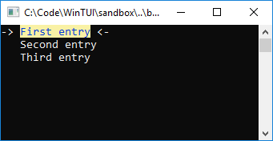

# WinTUI
Keyboard controlled UI elements for the Windows terminal.

## Example Usage


```
const char* array[] = {
    "First entry",
    "Second entry",
    "Third entry"
};

WinTUI::MenuSelector menu(array, 3);

menu.SetSelectedBefore([](std::ostream& ostream) {
    ostream << "-> ";
    WinTUI::Color::SetConsoleColor(WTUI_DARK_BLUE, WTUI_LIGHT_YELLOW);
});
menu.SetSelectedAfter([](std::ostream& ostream) {
    WinTUI::Color::ResetConsoleColor();
    ostream << " <-";
});

menu.SetUnselectedBefore([](std::ostream& ostream) {
    ostream << "   ";
});

 menu.SetUnselectedAfter([](std::ostream& ostream) {
     ostream << "   ";
});

std::cout << menu;
std::cout << "Chosen Item: " << array[menu.GetLastSelected()] << std::endl;
```
